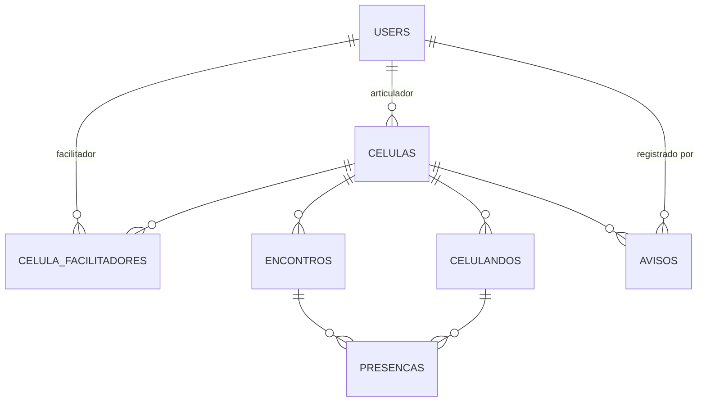

# Sistema FOCCO

Sistema de gestão para o **FOCCO — Formação de Células Cooperativas**, programa de
apoio à aprendizagem da UNEMAT baseado em células de estudo com aprendizagem
cooperativa. Substitui o controle manual por planilha (horários de sala,
horários das células e observações temporárias) por um sistema web com papéis
de acesso para coordenação, facilitadores e articuladores.

## Funcionalidades

- **Cadastro e gestão de células**: nome, tema, articulador responsável, dia da
  semana, turno, horário e sala; status (ativa/inativa/encerrada).
- **Celulandos**: cadastro dos participantes de cada célula e seu status.
- **Encontros e frequência**: registro de cada encontro (conteúdo trabalhado,
  duração, processamento de grupo) com lista de presença dos celulandos.
- **Avisos temporários**: substitui a antiga aba "Observações Temporárias" da
  planilha — trocas de sala, cancelamentos e exceções pontuais, com validade.
- **Dashboard da coordenação**: indicadores gerais do programa (células ativas,
  celulandos ativos, encontros recentes, taxa de presença, avisos ativos).
- **Usuários e papéis**: coordenação, facilitador e articulador, cada um com
  permissões diferentes.

## Papéis e permissões

| Ação                                   | Coordenação | Facilitador | Articulador          |
|-----------------------------------------|:-----------:|:-----------:|:--------------------:|
| Ver todas as células                    | ✅          | ✅          | ❌ (só as próprias)   |
| Criar/editar qualquer célula             | ✅          | ✅          | ❌                    |
| Editar a própria célula, celulandos e encontros | ✅    | ✅          | ✅ (só a própria)     |
| Ver dashboard da coordenação             | ✅          | ❌          | ❌                    |
| Gerenciar usuários                       | ✅          | ❌          | ❌                    |

## Arquitetura e decisões técnicas

- **Next.js 16 (App Router) + TypeScript**, com Server Components para leitura
  de dados e **Server Actions** para todas as mutações (criar célula, registrar
  encontro, etc.) — sem uma camada de API REST separada.
- **Drizzle ORM + PostgreSQL** (via `postgres.js`) no lugar do Prisma: Drizzle é
  100% TypeScript, sem binário nativo para baixar/instalar, o que também deixa
  o deploy em Docker mais simples e previsível.
- **Auth.js (NextAuth v5)** com login por e-mail/senha (`bcryptjs`) e sessão via
  JWT. Uma *Data Access Layer* (`src/lib/dal.ts`) centraliza a checagem de
  sessão e papel, seguida pelo guia oficial de autenticação do Next.js.
- **Autorização em duas camadas**: `proxy.ts` (antigo "middleware", renomeado no
  Next.js 16) faz a checagem otimista de sessão/rota; cada Server Action e
  página revalida a permissão de fato antes de ler ou escrever dados.
- **Tailwind CSS v4** para estilos, com paleta de cores baseada na marca do
  FOCCO.
- **Docker de ponta a ponta**: desenvolvimento (`docker-compose.yml`, com hot
  reload) e produção (`Dockerfile` multi-stage + `docker-compose.prod.yml`,
  compatível com `docker stack deploy` em Docker Swarm).

## Modelo de dados



- **users**: coordenação, facilitadores e articuladores (login no sistema).
  Celulandos **não** fazem login.
- **celulas**: uma célula de estudo, com um articulador responsável e (N:N)
  facilitadores que acompanham.
- **celulandos**: participantes de uma célula.
- **encontros** + **presencas**: um encontro por data, com presença por
  celulando.
- **avisos**: exceções pontuais (troca de sala, cancelamento), com validade.

## Rodando em desenvolvimento (Docker)

Pré-requisitos: Docker e Docker Compose.

```bash
cp .env.example .env   # ajuste se necessário (os padrões já funcionam com o compose)
docker compose up
```

Isso sobe o Postgres, instala as dependências, aplica as migrations e inicia o
Next.js em modo dev (hot reload) em **http://localhost:3000**.

Para popular o banco com dados de exemplo (baseados na planilha de horários do
FOCCO):

```bash
docker compose exec app npm run db:seed
```

Usuários de exemplo criados pelo seed (senha padrão `focco123`):

| Papel        | E-mail                              |
|--------------|--------------------------------------|
| Coordenação  | coordenacao@focco.unemat.br          |
| Facilitador  | (e-mail informado no seed)           |
| Articulador  | lara@focco.unemat.br, deisy@focco.unemat.br, ... |

> Troque as senhas assim que possível — o botão "Redefinir senha" na tela de
> Usuários volta a conta para a senha padrão a qualquer momento.

### Sem Docker (alternativa)

Se preferir rodar localmente sem Docker: Postgres 16 acessível via
`DATABASE_URL`, depois `npm install`, `npm run db:migrate`, `npm run db:seed` e
`npm run dev`.

## Deploy em produção (VPS / Docker Swarm)

1. Copie `.env.prod.example` para `.env.prod` e preencha `DB_PASSWORD`,
   `AUTH_SECRET` (gere com `openssl rand -base64 32`) e `AUTH_URL`.
2. Construa a imagem:
   ```bash
   docker build -t sistema_focco:latest .
   ```
3. Suba com `docker compose` (mais simples, um único servidor):
   ```bash
   docker compose -f docker-compose.prod.yml --env-file .env.prod up -d
   ```
   Ou, se preferir usar um Swarm já existente na VPS:
   ```bash
   export $(grep -v '^#' .env.prod | xargs)
   docker stack deploy -c docker-compose.prod.yml focco
   ```
4. As migrations do banco rodam automaticamente na inicialização do
   container (`docker-entrypoint.sh`), antes do servidor subir.
5. Coloque um reverso proxy (Nginx, Traefik ou Caddy) na frente da porta 3000
   com HTTPS — recomendado pela própria documentação de self-hosting do
   Next.js.

## Estrutura do projeto

```
src/
  app/
    login/                    página de login
    (app)/                    layout autenticado (nav, header, logout)
      celulas/                lista, criação, edição, detalhe
      avisos/                 avisos temporários
      coordenacao/            dashboard
      usuarios/               gestão de usuários (coordenação)
  auth.ts                     configuração do Auth.js
  proxy.ts                    checagem otimista de sessão/rota (ex-middleware)
  db/
    schema.ts                 schema Drizzle
    migrations/                migrations SQL geradas
    seed.ts                   seed de dados de exemplo
  lib/
    dal.ts                    Data Access Layer (sessão/autorização)
    actions/                  Server Actions (mutações)
    queries/                  leituras (Drizzle)
    validation.ts             schemas Zod
scripts/migrate.mjs           runner de migrations para produção (Docker)
Dockerfile                    build multi-stage (produção)
docker-compose.yml            ambiente de desenvolvimento
docker-compose.prod.yml       ambiente de produção (VPS/Swarm)
```

## Possíveis evoluções

Ideias que ficaram fora do escopo inicial e podem virar próximos passos (e
seções do artigo):

- Relatórios exportáveis (PDF/Excel) por célula ou período, para prestação de
  contas da coordenação.
- Avaliação estruturada dos 5 pilares da aprendizagem cooperativa por
  encontro, não só um campo de texto livre.
- Notificações (e-mail/WhatsApp) para articuladores sobre avisos temporários.
- Histórico/auditoria de alterações nas células.
- App/PWA para registro de presença offline durante o encontro.
